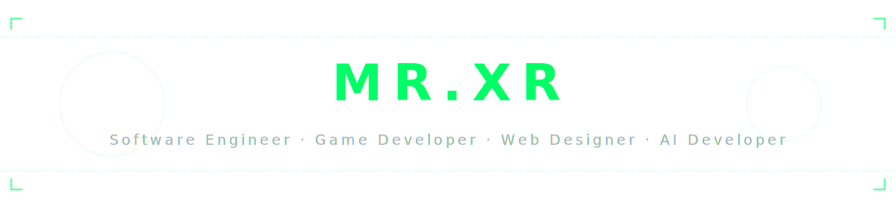

<div align="center">
  
</div>

<br/>

```text
┌─────────────────────────────────────────────────────┐
│                                                     │
│   MR.XR  ·  Amir                                    │
│                                                     │
│   Game Dev  ·  Web Designer  ·  Software Engineer   │
│   Co-Founder of INNERVOID                           │
│   Artificial Intelligence & AI Developer            │
│                                                     │
│   "Code is for humans to read, machines to run."    │
│                                                     │
└─────────────────────────────────────────────────────┘
```
> [!CAUTION]
> # About Me
>
> I don’t just write code; I engineer digital worlds from scratch. My relationship with technology and programming isn't just about a career—it's a deep-rooted passion for understanding how machines think and how structures are built.
>
> I operate as a **Software Engineer**, **Game Developer**, **AI Developer**, and **Web Designer**. Moving fluidly between different layers of technology is where I thrive. Whether it's managing low-level logic and memory in **C/C++**, architecting back-end ecosystems with **Python (Django, Flask, Node.js)**, or crafting intelligent behaviors through **AI development**, I approach every project with strict precision.
>
> On the creative and visual front, I bridge the gap between aesthetics and functionality. From designing responsive, modern user interfaces using **HTML, CSS, and JavaScript**, to developing complex interactive systems in gaming through **Blueprints**, I ensure that every line of code serves a purpose.
>
> For me, programming is an art of continuous problem-solving. I am driven by an insatiable curiosity for computing and a commitment to building robust, high-performance software that pushes boundaries.

## 🛠️ Skills

<p align="center">
  <!-- HTML5 -->
  <a href="https://developer.mozilla.org/en-US/docs/Web/HTML" target="_blank" rel="noreferrer">
    
  </a>
  <!-- CSS3 -->
  <a href="https://developer.mozilla.org/en-US/docs/Web/CSS" target="_blank" rel="noreferrer">
    
  </a>
  <!-- JavaScript -->
  <a href="https://developer.mozilla.org/en-US/docs/Web/JavaScript" target="_blank" rel="noreferrer">
    
  </a>
  <!-- Python -->
  <a href="https://www.python.org" target="_blank" rel="noreferrer">
    
  </a>
  <!-- C -->
  <a href="https://en.cppreference.com/w/c" target="_blank" rel="noreferrer">
    
  </a>
  <!-- C++ -->
  <a href="https://isocpp.org" target="_blank" rel="noreferrer">
    
  </a>
  <!-- Node.js -->
  <a href="https://nodejs.org" target="_blank" rel="noreferrer">
    
  </a>
  <!-- Godot -->
  <a href="https://godotengine.org" target="_blank" rel="noreferrer">
    
  </a>
  <!-- Unreal Engine -->
  <a href="https://www.unrealengine.com" target="_blank" rel="noreferrer">
    
  </a>
  <!-- Blueprints -->
  <a href="https://dev.epicgames.com/documentation/en-us/unreal-engine/blueprints-visual-scripting-in-unreal-engine" target="_blank" rel="noreferrer">
    
  </a>
</p>

## Interests & Mastery

⚙️ **Programming** (90%)
<progress value="90" max="100" width="100%"></progress>

🎵 **Music** (100%)
<progress value="100" max="100" width="100%"></progress>

🌐 **Web & Data** (80%)
<progress value="80" max="100" width="100%"></progress>

🎮 **Gaming** (75%)
<progress value="75" max="100" width="100%"></progress>

🕹️ **Game Dev** (65%)
<progress value="65" max="100" width="100%"></progress>

---

<br />

<div align="center">
  <h3>
    <code>"Machines outlive flesh, but code outlives time; I don't just build, I leave an empire in the syntax."</code>
  </h3>
</div>

<br />
